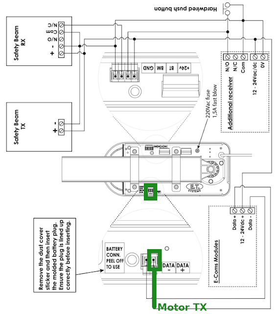
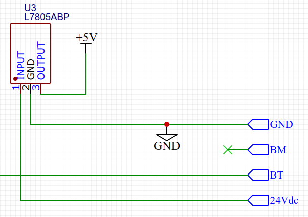
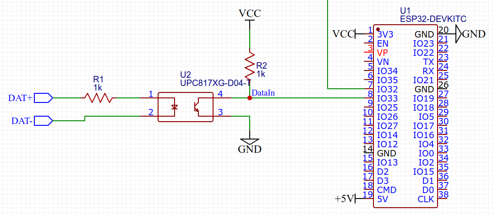
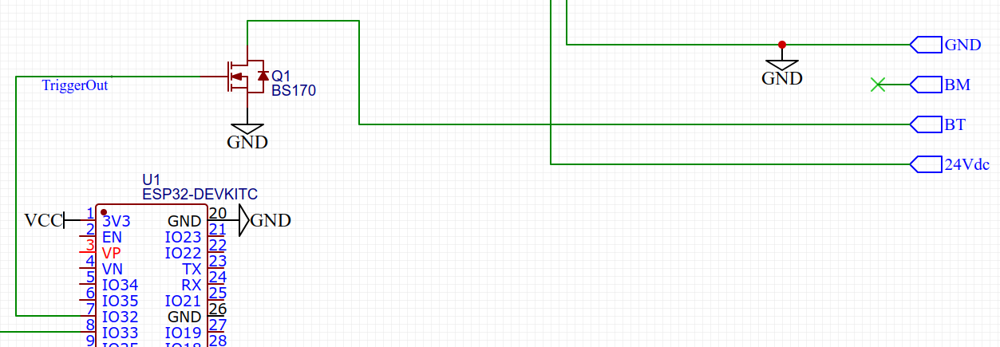
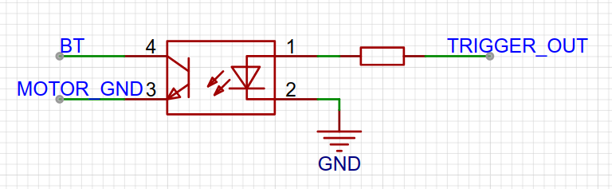

# ET/Nice DC Blue Advanced

This is an ESPhome component for connecting an ET/Nice DC Blue Advanced to Home Assistant.
The component uses the DC Blue's digital interface to read the state of the door and light.
Control is done via the button trigger input as the digital interface does not support control.
This component will only work with the DC Blue Advanced range of door motors, not with older models without the digital interface.

## Wiring

On the top side of the motor you will find two screw terminal blocks.

1. E-Coms connection marked with `DATA-` and `DATA+`.
2. Power and trigger input with `24V`, `BT`, `BM` and `GND`.



Power is taken from `24V` and `GND`, fed through an LM7805 or similar.
Preferably use a [switching regulator](https://www.robotics.org.za/5V1A-BUCK-REG) to prevent overheating of this regulator.
The 5V line is connected to the ESP32 devkit's 5V input.



The `DATA+` line outputs the digital signal at 24V, while `DATA-` is connected to ground.
We take this signal and feed it via an opto-isolator.
On the other side of the optocoupler we use a non-inverting circuit to connect it to an ESP32 GPIO33.



Triggering of the door is done by shorting `BT` to ground.
We can do this via a mosfet or an opto-isolator.
Here we use GPIO32 to trigger the mosfet.



A better way to trigger the motor is via an optocoupler.



## Configuration

Two example yaml config files are provided here.

- `dc_blue_local.yaml` can be used to locally compile the ESPhome firmware image.
- `dc_blue.yaml` shows a working config file from the ESPhome Home Assistant addon.

We will now describe the main additions you will need to add the DC Blue component to your device config.

### Include source code

```
# Import component directly from Github, always refreshing, using latest commit on master branch
external_components:
  - source:
      type: git
      url: https://github.com/jpmeijers/dc-blue-esphome
      ref: master
    refresh: 0s
    components: [ dc_blue ]
```

### Configure plaform

```
# Initialise the platform
dc_blue:
  data_pin: GPIO33
  trigger_pin: GPIO32
  # symbol_period: 970
```

`data_pin` is where the digital signal from the motor is received.
`trigger_pin` will send a pulse when the motor is triggered.
`symbol_period` is the data rate of the digital signal. This will likely not need to be changed.

### Configure light sensor

```
# Add if you want a binary sensor following the garage door motor light
binary_sensor:
  - platform: dc_blue
    light:
      name: "Garage Motor Light"
```

By adding this sensor, you will get a boolean sensor in Home Assistant indicating the current state of the garage door motor light.

### Cover sensor

```
cover:
  - platform: dc_blue
    name: "Garage Door"
    device_class: garage
```

By adding this definition we expose a cover sensor to Home Assistant which indicates the current state of the door.
This also adds the controls to open, close of stop the door.

## Limitations

The motor reports a "running" state, not a "opening" and "closing" state.
This component assumes "opening" if the motor was closed, and the new state is "running".
The same for "open" to "running".

The open, close and stop triggers all just send a single pulse to the motor.
This is similar to pressing the button on the remote.
For example, pressing stop during closing of the door does not stop the door, but will make it open up again.
This component does not take all these different state transitions into account, but simply sends a pulse, then interprets the state the motor reports afterwards.

While the door is opening, pressing stop twice will therefore close the door.

This can be improved by better handling of the door state in `dc_blue_cover.cpp`.
