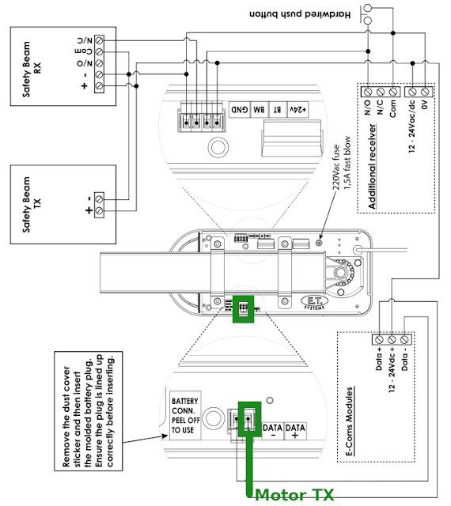
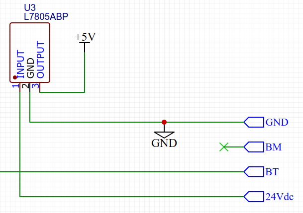
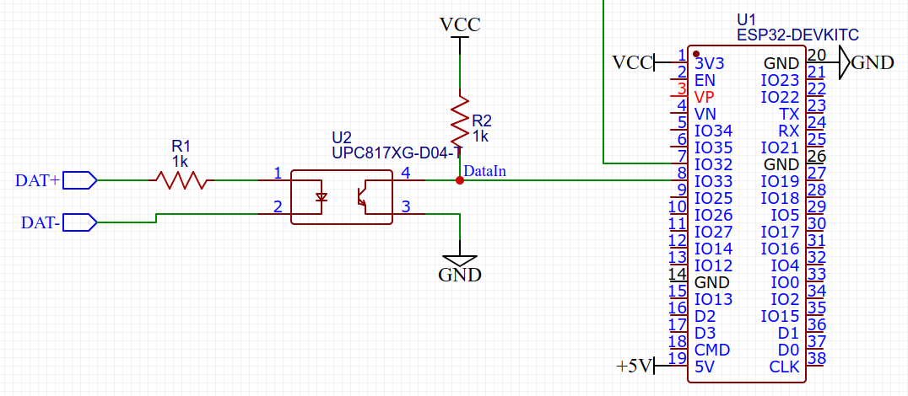
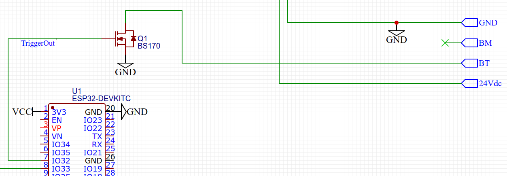
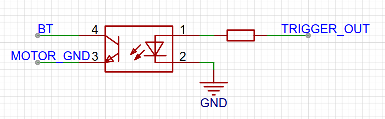

# ET/Nice DC Blue Advanced

> This component is experimental and you are using it at your own risk.

This is an ESPhome component for connecting an ET/Nice DC Blue Advanced to Home Assistant.
The component uses the DC Blue's digital interface to read the state of the door and light.
Control is done via the button trigger input as the digital interface does not support control.
This component will only work with the DC Blue Advanced range of door motors, not with older models without the digital interface.

> **Note:** This component requires ESPHome 2025.7.0 or newer.

## Supported Frameworks

This component supports both ESP32 frameworks:

| Framework | Status | Notes |
|-----------|--------|-------|
| **Arduino** | ✅ Supported | Legacy framework |
| **ESP-IDF** | ✅ Supported | Default framework, smaller binary size |

The component automatically detects which framework is being used and configures the appropriate timer APIs via compile-time directives.

### Framework Selection

To use the ESP-IDF framework (default):
```yaml
esp32:
  board: esp32dev
  framework:
    type: esp-idf
```

To use the Arduino framework:
```yaml
esp32:
  board: esp32dev
  framework:
    type: arduino
```

## Wiring

On the top side of the motor you will find two screw terminal blocks.

1. E-Coms connection marked with `DATA-` and `DATA+`.
2. Power and trigger input with `24V`, `BT`, `BM` and `GND`.



Power is taken from `24V` and `GND`, fed through an LM7805 or similar.
Preferably use a [switching regulator](https://www.robotics.org.za/5V1A-BUCK-REG) to prevent overheating of this regulator.
The 5V line is connected to the ESP32 devkit's 5V input.



The `DATA+` line outputs the digital signal at 24V, while `DATA-` is connected to ground.
We take this signal and feed it via an opto-isolator.
On the other side of the optocoupler we use a non-inverting circuit to connect it to an ESP32 GPIO33.



Triggering of the door is done by shorting `BT` to ground.
We can do this via a mosfet or an opto-isolator.
Here we use GPIO32 to trigger the mosfet.



A better way to trigger the motor is via an optocoupler.



## Configuration

Two example yaml config files are provided here for local compilation:

- `dc_blue_local_arduino.yaml` uses the Arduino framework.
- `dc_blue_local_idf.yaml` uses the ESP-IDF framework.

`dc_blue.yaml` shows a working config file for use in the ESPhome Home Assistant addon.

We will now describe the main additions you will need to add the DC Blue component to your device config.

### Include source code

```
# Import component directly from Github, always refreshing, using latest commit on master branch
external_components:
  - source:
      type: git
      url: https://github.com/jpmeijers/dc-blue-esphome
      ref: master
    refresh: 0s
    components: [ dc_blue ]
```

### Configure platform

```
dc_blue:
  # Required: Pin where data is received
  data_pin: GPIO33
  # Required: Pin which is pulled high to "press button"
  trigger_pin: GPIO32
  # Optional: Time per symbol in us
  symbol_period: 970
  # Optional: Is the data signal from the motor inverted by optocoupler?
  inverted: True
  # Optional: Time to press button in ms
  trigger_period: 1000
  # Optional: Minimum between presses in ms
  clear_period: 1000
```

`data_pin` is where the digital signal from the motor is received.
`trigger_pin` will send a pulse when the motor is triggered.
`symbol_period` is the data rate of the digital signal. This will likely not need to be changed.

### Configure light sensor

```
# Add if you want a binary sensor following the garage door motor light
binary_sensor:
  - platform: dc_blue
    light:
      name: "Garage Motor Light"
```

By adding this sensor, you will get a boolean sensor in Home Assistant indicating the current state of the garage door motor light.

### Configure AC supply sensor

```
# Add if you want a binary sensor to show if the dc blue unit is connected to an AC mains supply
binary_sensor:
  - platform: dc_blue
    ac_power:
      name: "Garage Motor AC supply"  
```

By adding this sensor, you will get a boolean sensor in Home Assistant indicating that garage door motor is being powered by an AC mains supply.

### Cover sensor

```
cover:
  - platform: dc_blue
    name: "Garage Door"
    device_class: garage
```

By adding this definition we expose a cover sensor to Home Assistant which indicates the current state of the door.
This also adds the controls to open, close of stop the door.

## Limitations

The motor reports a "running" state, not a "opening" and "closing" state.
This component assumes "opening" if the motor was closed, and the new state is "running".
The same for "open" to "running".

The open, close and stop triggers all just send a single pulse to the motor.
This is similar to pressing the button on the remote.
For example, pressing stop during closing of the door does not stop the door, but will make it open up again.
This component does not take all these different state transitions into account, but simply sends a pulse, then interprets the state the motor reports afterwards.

While the door is opening, pressing stop twice will therefore close the door.

This can be improved by better handling of the door state in `dc_blue_cover.cpp`.

## Factory firmware

The `improv.yaml` file can be used to build a factory default firmware image.
This configuration provides [improv](https://www.improv-wifi.com/) capabilities.
It allows sending WiFi credentials to the device, without having to use a USB-Serial adapter.

To load the factory firmware:
```
# Erase flash to clear all saved WiFi credentials
esptool --chip esp32 --port /dev/ttyUSB0 erase_flash

# Build and flash improv firmware
docker run --rm --privileged -v "${PWD}":/config --device=/dev/ttyUSB0 -it ghcr.io/esphome/esphome run improv.yaml
```

> Note: You might need to put the ESP32 into programming mode.
> This is done by holding down the BOOT button, and then momentarily pressing the RESET button.
> Then releasing BOOT.

### Configure WiFi credentials over BLE

Go to [https://www.improv-wifi.com/](https://www.improv-wifi.com/) and under **Improv via BLE** click on the button **Connect device to Wi-Fi**.
Follow the wizzard to pair the device, then add WiFi credentials to it.

### Configure using WiFi AP

Scan for available WiFi networks.
You should see one named "dc-blue-advanced-####".
Connect to it, then in your browser go to [http://192.168.4.1](http://192.168.4.1).
You should see a page listing available WiFi networks.
Choose the network the ESPhome device should use, fill in the password, and wait for it to reconnect.

### Adopting into ESPhome Builder

If either of the previous two steps succeeded, the device should have connected to your WiFi network.
ESPhome Builder will discover it, and show it as a device that can be adopted.

### Configuration

ESPhome builder will create a default config for the device.
You can edit this config by adding the configurations described under [Configuration](#configuration).
The firmware can then be installed on your device.

If building the firmware fails with an OTA error, add the following block to the end of the configuration:
```
ota:
  - platform: esphome
```

## Hardware

The `hardware` directory contains a project file for [EasyEDA](https://easyeda.com).
It contains a schematic and PCB design.
The PCB layout is designed to fit inside a Hammond 1591XXMFLBK enclosure.
Components were chosen to allow manufacturing and assembly by [LCSC](https://lcsc.com/) and [JLCPCB](https://jlcpcb.com/).
